# Predictive Modeling and Explainability Analysis of Cost Overrun and Schedule Delay in Construction Projects

## Introduction
Construction projects frequently face challenges related to cost overruns and schedule delays, which can significantly impact project profitability, resource utilization, and stakeholder confidence. Early identification of these risks enables project managers to take corrective actions and improve overall project performance.

A comprehensive machine learning workflow was implemented, including exploratory data analysis, feature engineering, feature selection, baseline modeling, hyperparameter optimization, explainability analysis, and statistical validation. Multiple classical machine learning models, deep learning architectures, and modern pretrained tabular models were evaluated and compared.

---

## Objective
To evaluate the feasibility of predicting cost overruns and schedule delays in construction projects using machine learning and explainable AI techniques.

---

## Dataset Description

The dataset  used in this study connsists of 150 real world construction projects collected across different project categories. Each record represents a single project and contains information related to project costs, schedule performance, risk exposure, contractor experience and operation factors.

The dataset was developed to investigate the feasibility of predicting two critical project outcomes:

- Cost Overrun Flag
- Delay Flag

Both variables are binary in nature, where 1 indicates that the event occured and 0 indicates vice versa.

In addition to the original project attributes, several engineered features were later developed to capture more complex relationships between project characteristics and outcomes.

---

### Dataset Characteristics

| Attribute | Value |
|------------|---------|
| Number of Projects | 150 |
| Number of Features | 21 |
| Numerical Features | 15 |
| Categorical Features | 3 |
| Target Variables | 2 |
| Project Categories | Residential, Commercial, Infrastructure, Mixed-Use |

---

### Target Variables

**Cost Overrun Flag**

Indicates whether the actual project cost exceeded the planned baseline cost.

| Value | Meaning |
|---------|---------|
| 0 | No Cost Overrun |
| 1 | Cost Overrun |

**Delay Flag**

Indicates whether the project experienced schedule delays relative to the planned duration.

| Value | Meaning |
|---------|---------|
| 0 | On Schedule |
| 1 | Delayed |

---

### Feature Description

| # | Feature Name | Type | Category | Description |
|---|--------------|------|----------|-------------|
| 1 | Project Type | Categorical | Project Attribute | Infrastructure, Commercial, Residential, Industrial, Mixed Use |
| 2 | Baseline Cost (cr) | Numerical | Financial | Initial estimated project cost in crores |
| 3 | Baseline Duration (Months) | Numerical | Scheduling | Planned project duration in months |
| 4 | Productivity Index | Numerical | Resource | Ratio of work output to planned output (0–1 scale) |
| 5 | Schedule Adherence % | Numerical | Scheduling | Percentage of milestones completed on time |
| 6 | Risk Score | Numerical | Risk | Composite risk rating assigned at project inception |
| 7 | Delay Events | Numerical | Scheduling | Number of recorded delay incidents during project |
| 8 | Safety Incidents | Numerical | Safety | Count of on-site safety incidents reported |
| 9 | Weather Disruptions | Numerical | External Risk | Number of work stoppages due to adverse weather |
| 10 | Permit Delays Days | Numerical | Administrative | Total days lost due to permit/regulatory delays |
| 11 | Primary Contractor Exp. Years | Numerical | Resource | Years of experience of the primary contractor |
| 12 | No. of Subcontractors | Numerical | Resource | Total number of subcontractors involved |
| 13 | Procurement Method | Categorical | Procurement | Method used for contractor selection (Open Tender, Selective Tender, Direct Award, E-Procurement) |

---

## Exploratory Data Analysis

Exploratory Data Analysis was conducted on the raw dataset to understand the statistical 
properties of features, identify distributional patterns, and uncover relationships between 
features and target variables. The insights derived from EDA directly informed subsequent 
modeling decisions, particularly feature engineering strategies and model selection. 

### Descriptive Statistics 

Descriptive statistical analysis was performed to summarize the central tendency, variability, and distribution of the numerical features within the dataset. Metrics such as mean, standard deviation, minimum, maximum, and skewness were examined to gain an initial understanding of the project characteristics. 

The descriptive statistics indicate substantial diversity in project size, duration, and operational conditions across the dataset. Baseline cost and project duration exhibit the highest variability, reflecting the presence of both small and large-scale construction projects. Most risk and operational features show slight positive skewness, suggesting that while the majority of projects experience moderate levels of risk-related events, a smaller number of projects are exposed to significantly higher disruptions. 

Overall, the dataset captures a broad range of project characteristics, making it suitable for investigating the factors influencing cost overruns and schedule delays.

| Feature | Mean | Median | Std Dev | Min | Max | Skewness |
|----------|------|--------|---------|-----|-----|----------|
| Baseline Cost (cr) | ~150 | ~140 | ~60 | 50 | 300 | Moderate Right |
| Baseline Duration (Months) | ~24 | ~22 | ~9 | 6 | 48 | Slight Right |
| Productivity Index | ~0.75 | ~0.76 | ~0.10 | 0.40 | 1.00 | Slight Left |
| Schedule Adherence % | ~70 | ~72 | ~15 | 30 | 100 | Slight Left |
| Risk Score | ~0.40 | ~0.38 | ~0.12 | 0.10 | 0.70 | Slight Right |
| Delay Events | ~5 | ~5 | ~3 | 0 | 14 | Slight Right |
| Safety Incidents | ~4 | ~4 | ~2 | 0 | 10 | Slight Right |
| Weather Disruptions | ~3 | ~3 | ~2 | 0 | 9 | Slight Right |
| Permit Delays Days | ~7 | ~7 | ~3 | 1 | 14 | Approx. Symmetric |
| Contractor Exp. Years | ~15 | ~15 | ~5 | 5 | 28 | Approx. Symmetric |
| No. of Subcontractors | ~6 | ~6 | ~3 | 1 | 14 | Approx. Symmetric |

---

### Target Variable Distribution

The figure below presents the class distribution for both target variables. Both Cost Overrun Flag and Delay Flag show approximately balanced distributions, with a slight imbalance in Delay Flag Distribution that motivated the use of stratified sampling and class-weighted models.

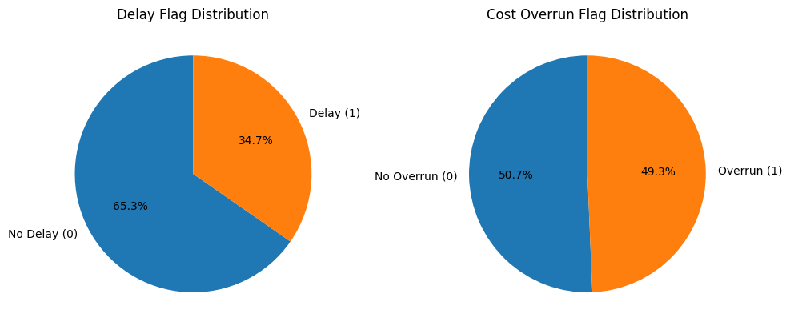

---

### Categorical Feature Analysis

The figure below presents count distributions for categorical features. Project Type is distributed 
across five categories (Infrastructure, Commercial, Residential, Industrial, Mixed-Use), while 
Procurement Method spans four categories (Open Tender, Selective Tender, Direct Award, E
Procurement). The distributions are approximately uniform, ensuring representation of all 
procurement strategies and project types.

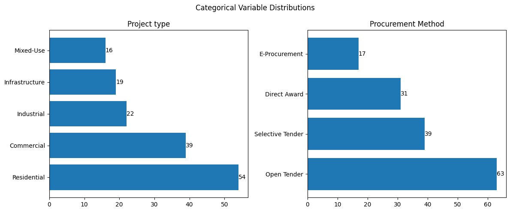

---

### Correlation Analysis

The figure shows the Pearson correlation heatmap among numerical features. Key observations 
include: 

- Baseline Cost and Baseline Duration exhibit moderate positive correlation, reflecting 
the natural relationship between project scale and timeline. 
- Productivity Index and Schedule Adherence % show moderate positive correlation, 
suggesting that productive projects tend to meet their schedules. 
- Risk Score and Delay Events show weak positive correlation with both target 
variables, suggesting that these features individually have limited linear predictive 
power. 
- **No single feature exhibits strong linear correlation with either target, motivating the 
need for feature engineering to capture non-linear interactions.**

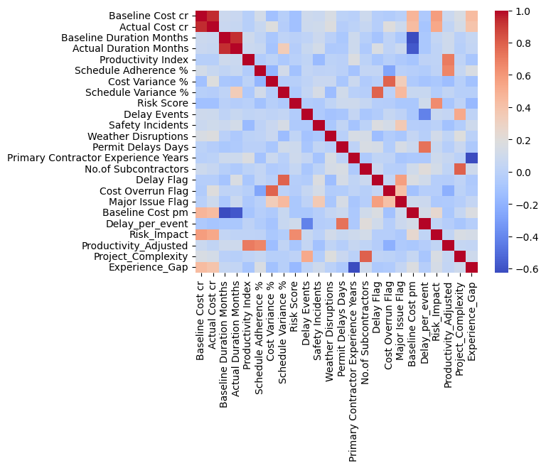

---

### Distribution Analysis of Key Features

- Baseline Cost and Actual Cost exhibit wide distributions, indicating the presence of projects with significantly different scales and budgets.

- Baseline Duration and Actual Duration show considerable variation, suggesting that the dataset contains both short-term and long-term construction projects.

- Productivity Index and Productivity_Adjusted are approximately normally distributed, with most projects concentrated around moderate productivity levels.

- Schedule Adherence % is skewed toward higher values, indicating that a substantial proportion of projects maintained relatively good schedule compliance.

- Cost Variance % and Schedule Variance % follow approximately bell-shaped distributions, suggesting that most projects experienced moderate deviations from planned estimates.

- Risk Score is slightly right-skewed, indicating that while most projects have moderate risk exposure, a smaller number of projects face substantially higher risks.

- Delay Events, Safety Incidents, and Permit Delay Days exhibit positive skewness, showing that severe disruptions occur less frequently but can significantly affect certain projects.

- Weather Disruptions are highly concentrated at lower values, suggesting that most projects experienced minimal weather-related interruptions.

- Primary Contractor Experience Years follows a near-normal distribution, indicating a balanced mix of experienced and less experienced contractors.

- Delay Flag and Cost Overrun Flag are relatively balanced across classes, making them suitable for classification modeling without severe class imbalance concerns.

- Major Issue Flag is noticeably imbalanced, with most projects not reporting major issues.

- Engineered features such as Delay_per_event, Risk_Impact, and Experience_Gap exhibit strong positive skewness, indicating the presence of a small number of projects with exceptionally high risk or disruption levels.

- Project_Complexity displays a broad distribution across complexity levels, suggesting adequate representation of both simple and complex projects within the dataset.

- **Overall, the dataset captures substantial variability in project cost, schedule, risk, and operational conditions, providing a suitable foundation for predictive modeling and explainability analysis.**

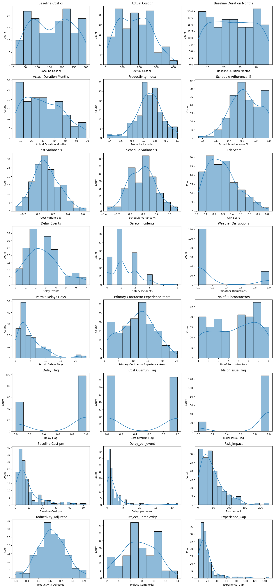

---

### EDA-Driven Modelling Decisions

The following modelling decisions were directly motivated by EDA findings:

| EDA Observation | Modeling Decision |
|-----------------|-------------------|
| Slight class imbalance in both targets | Stratified K-Fold Cross-Validation and class weights applied where supported |
| Skewed numerical features (Cost, Duration) | Standard scaling applied for Logistic Regression, KNN, and SVM |
| Weak direct linear correlations with targets | Feature engineering used to create interaction and ratio features |
| Mixed data types (numerical + categorical) | One-Hot Encoding applied; CatBoost leveraged native categorical handling |
| No strong single-feature predictors | Ensemble and non-linear models prioritized in the final modeling pipeline |

--- 

## Feature Engineering
Feature engineering was performed to address the weak linear relationships identified during 
EDA and to introduce richer representations of project complexity, efficiency, and risk. 

Individual raw features may carry limited predictive signal when examined in isolation. By 
constructing derived features that capture ratios, interaction effects, complexity aggregates, and 
imbalance indicators, the feature space can be enriched to enable models to learn from higher
order relationships that are not directly measurable but are theoretically meaningful in the 
construction domain.

| Feature | Formula | Type | Justification |
|----------|----------|----------|----------|
| **Cost per Month** | Baseline Cost ÷ Baseline Duration | Ratio | Normalizes project cost relative to duration and captures monthly cost intensity. |
| **Delay per Event** | Permit Delay Days ÷ Delay Events | Ratio | Represents the average administrative delay associated with each delay incident. |
| **Risk Impact** | Risk Score × Baseline Cost | Interaction | Captures the combined effect of project scale and risk severity; larger high-risk projects face greater exposure. |
| **Productivity Adjusted** | Productivity Index × Schedule Adherence (%) | Interaction | Measures overall operational efficiency by combining productivity and schedule performance. |
| **Project Complexity** | No. of Subcontractors + Delay Events + Weather Disruptions | Complexity Indicator | Aggregates multiple operational challenges into a proxy measure of project complexity. |
| **Experience Gap** | Baseline Cost ÷ Contractor Experience Years | Stress Indicator | Quantifies the mismatch between project scale and contractor experience; higher values indicate greater management stress. |

---

## Methodology

The following section provides a comprehensive overview of the methodology adopted for this study.

### Data Preprocessing

Prior to modeling, the following preprocessing steps were applied to ensure data quality and 
compatibility with the models: 

- Missing Value Treatment: The dataset contained no missing values post-curation; no imputation was required. 

- Categorical Encoding: Categorical variables (Project Type, Procurement Method) were one-hot encoded for models requiring numerical inputs (Logistic Regression, MLP). CatBoost natively handles categorical features and was provided with category indices directly. 

- Feature Scaling: Standard scaling (zero mean, unit variance) was applied to numerical features for Logistic Regression, KNN, and SVM to ensure distance-based and  gradient-based models are not dominated by high-magnitude features. 

- Class Imbalance Handling: Stratified K-Fold cross-validation was employed to  preserve class proportions across folds. Class weights were incorporated into applicable models (Logistic Regression, SVM) to penalize misclassification of the minority class. 

---

### Baseline Modelling

A baseline modeling experiment was conducted using only the original domain-specific features (prior to feature engineering) to establish a reference point for model performance.

This stage serves two purposes:

1. To assess the predictability of cost overrun and delay using the original project features.
2. To justify the need for feature engineering and subsequent model refinement.

---

#### Models Used
Five baseline models were selected to represent diverse machine learning paradigms and provide a comprehensive comparison framework. 

Logistic Regression was included as a linear baseline, K-Nearest Neighbors (KNN) as a distance-based method, Support Vector Machine (SVM) as a margin-based classifier, XGBoost as a gradient boosting ensemble, and CatBoost as a modern boosting algorithm optimized for tabular data. 

Together, these models capture a wide range of learning strategies, enabling assessment of both linear and non-linear relationships within the dataset.

---

#### Hyperparameter Tuning

The purpose of the baseline phase was to establish a fair and consistent benchmark for comparing different machine learning algorithms under standard settings. Using default or near default configurations allows the inherent strengths and weaknesses of each modeling approach to be evaluated without the influence of extensive optimization. 

This stage was intended to identify promising candidate models for further investigation rather than maximize predictive performance.

#### Experimental Setup

| Component | Description |
|------------|------------|
| **Input Features** | 13 raw domain-specific features (see the [Feature Description Table](#feature-description)) |
| **Target Variables** | Cost Overrun Flag, Delay Flag (modeled independently) |
| **Models** | Logistic Regression, K-Nearest Neighbors (KNN), Support Vector Machine (SVM), XGBoost, CatBoost |
| **Evaluation Protocol** | Stratified 10-Fold Cross-Validation with mean and standard deviation reported across folds |
| **Evaluation Metrics** | F1 Score, ROC-AUC, Accuracy, Precision, Recall, Matthews Correlation Coefficient (MCC) |

All models were trained using default hyperparameters during the baseline stage to ensure a fair comparison without optimization bias. Categorical encoding and feature scaling were applied as described previously.

---

```python

# Input and target features for the baseline modelling
# These are based on suggestions from domain experts

INPUT_FEATURES = [
    'Project type',
    'Baseline Cost cr',
    'Baseline Duration Months',
    'Productivity Index',
    'Schedule Adherence %',
    'Risk Score',
    'Delay Events',
    'Safety Incidents',
    'Weather Disruptions',
    'Permit Delays Days',
    'Primary Contractor Experience Years',
    'No.of Subcontractors',
    'Procurement Method',
]

TARGETS = ['Cost Overrun Flag', 'Delay Flag']
```
---

#### Metric Selection Rationale

Given the binary classification nature of the problem and the presence of slight class imbalance, the following evaluation metrics were selected:


| Metric | Mathematical Formula | Rationale |
|---------|---------|---------|
| **F1 Score** | $F1 = 2 \times \frac{\text{Precision} \times \text{Recall}}{\text{Precision} + \text{Recall}}$ | Balances false positives and false negatives; critical for imbalanced data |
| **ROC-AUC** | $AUC = \int_{0}^{1} TPR(FPR^{-1}(x))\,dx$ | Threshold-independent measure of discriminative ability |
| **Accuracy** | $\text{Accuracy} = \frac{TP + TN}{TP + TN + FP + FN}$ | Measures overall correctness; may be misleading under class imbalance |
| **Precision** | $\text{Precision} = \frac{TP}{TP + FP}$ | Measures reliability of positive predictions |
| **Recall** | $\text{Recall} = \frac{TP}{TP + FN}$ | Measures ability to detect actual positive cases |
| **MCC** | $\text{MCC} = \frac{TP \times TN - FP \times FN}{\sqrt{(TP+FP)(TP+FN)(TN+FP)(TN+FN)}}$ | Most informative for binary classification; incorporates all confusion matrix outcomes |

---

#### Baseline Modelling Results

The baseline models were evaluated using the original domain-specific features without any feature engineering or hyperparameter optimization. The following table summarizes the mean and standard deviation of the evaluation metrics obtained through Stratified 10-Fold Cross-Validation.


| Target | Model | Accuracy (Mean ± Std) | Precision (Mean ± Std) | Recall (Mean ± Std) | F1 (Mean ± Std) | ROC-AUC (Mean ± Std) | MCC (Mean ± Std) |
|----------|----------|----------|----------|----------|----------|----------|----------|
| Cost Overrun Flag | CatBoost | 0.540 ± 0.124 | 0.574 ± 0.207 | 0.511 ± 0.185 | 0.513 ± 0.142 | 0.561 ± 0.104 | 0.090 ± 0.262 |
| Cost Overrun Flag | KNN | 0.513 ± 0.100 | 0.512 ± 0.093 | 0.552 ± 0.117 | 0.526 ± 0.091 | 0.506 ± 0.113 | 0.024 ± 0.198 |
| Cost Overrun Flag | Logistic Regression | 0.567 ± 0.114 | 0.574 ± 0.176 | 0.523 ± 0.194 | 0.532 ± 0.157 | 0.593 ± 0.145 | 0.139 ± 0.242 |
| Cost Overrun Flag | SVM | 0.493 ± 0.126 | 0.517 ± 0.220 | 0.418 ± 0.149 | 0.445 ± 0.137 | 0.426 ± 0.103 | -0.007 ± 0.273 |
| Cost Overrun Flag | XGBoost | 0.500 ± 0.110 | 0.501 ± 0.158 | 0.484 ± 0.148 | 0.483 ± 0.131 | 0.480 ± 0.133 | -0.003 ± 0.230 |
| Delay Flag | CatBoost | 0.520 ± 0.121 | 0.618 ± 0.085 | 0.639 ± 0.191 | 0.623 ± 0.136 | 0.500 ± 0.195 | -0.074 ± 0.214 |
| Delay Flag | KNN | 0.640 ± 0.114 | 0.703 ± 0.085 | 0.773 ± 0.119 | 0.734 ± 0.093 | 0.602 ± 0.135 | 0.174 ± 0.263 |
| Delay Flag | Logistic Regression | 0.527 ± 0.106 | 0.662 ± 0.110 | 0.527 ± 0.198 | 0.573 ± 0.161 | 0.525 ± 0.159 | 0.035 ± 0.189 |
| Delay Flag | SVM | 0.560 ± 0.138 | 0.679 ± 0.143 | 0.610 ± 0.165 | 0.636 ± 0.145 | 0.572 ± 0.163 | 0.064 ± 0.285 |
| Delay Flag | XGBoost | 0.540 ± 0.149 | 0.610 ± 0.106 | 0.739 ± 0.227 | 0.663 ± 0.153 | 0.449 ± 0.203 | -0.130 ± 0.246 |

---

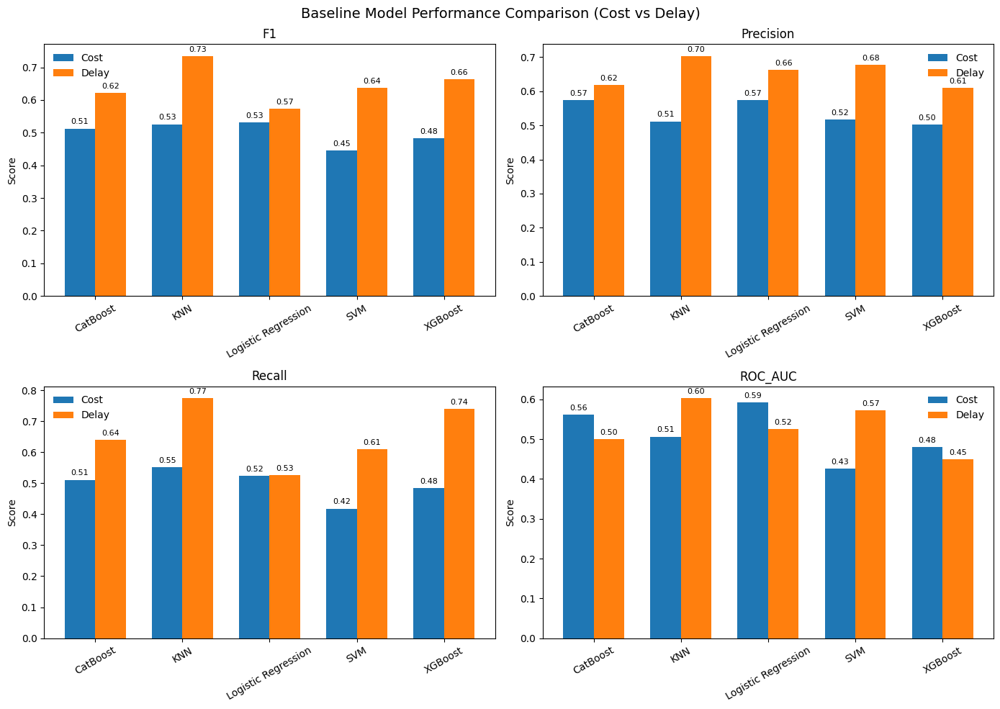


---


#### Key Observations – Cost Overrun

- Overall performance across all models is close to random, with ROC-AUC values ranging from approximately **0.43 to 0.59**, indicating a weak predictive signal in the raw feature set for cost-related outcomes.

- Logistic Regression demonstrates the strongest baseline performance for cost prediction (**ROC-AUC = 0.593**, **MCC = 0.139**), suggesting that the limited predictive information present in the dataset is primarily captured through linear relationships.

- SVM and XGBoost exhibit poor discrimination ability (**ROC-AUC < 0.50**) and near-zero or negative MCC values, indicating difficulty in identifying meaningful patterns from the raw feature space.

- Relatively high standard deviations across cross-validation folds (**Accuracy_std ≈ 0.10–0.13**, **ROC-AUC_std ≈ 0.10–0.15**) indicate instability and sensitivity to train-test splits, further supporting the conclusion that cost overrun prediction is challenging using only the original features.

#### Key Observations – Delay

- Delay prediction is comparatively more successful than cost overrun prediction, with F1 scores ranging from approximately **0.57 to 0.73**, indicating a stronger predictive signal within the raw features.

- KNN achieves the best baseline delay performance (**F1 = 0.734**, **ROC-AUC = 0.602**, **MCC = 0.174**), suggesting the presence of localized neighborhood structures in the feature space that contribute to delay prediction.

- CatBoost performs relatively poorly in the baseline setting (**ROC-AUC = 0.500**, **negative MCC**), indicating that its full potential may require feature engineering and hyperparameter optimization.

- A noticeable discrepancy exists between F1 Score and ROC-AUC for certain models. For example, XGBoost achieves a relatively high **F1 Score of 0.663** while producing a **ROC-AUC of only 0.449**, suggesting threshold-dependent performance and poor probability calibration.

- The baseline results establish three important findings:
  - Cost Overrun is difficult to predict using the original project features.
  - Delay exhibits moderate predictability from the raw feature set.
  - Model selection alone is insufficient to achieve substantial performance improvements, motivating the need for feature engineering and model refinement.

---

### Feature Selection

Feature selection was performed to identify the most informative subset of features for each target variable and to remove features that contribute negatively or marginally to model performance. This step is treated as a supporting stage rather than the core of the analysis. 

#### Method Employed

Feature importance was computed using **CatBoost with the LossFunctionChange metric.** 
Unlike permutation-based or split-count importance methods, LossFunctionChange evaluates 
the contribution of each feature to the model's loss function. Features that, when removed, lead 
to an increase in loss (positive importance) are retained, while features that degrade or 
negligibly affect the objective function (negative or near-zero importance) are considered 
candidates for removal. 

CatBoost was selected for this role because of its robust handling of heterogeneous tabular 
data, native support for categorical features without preprocessing, and use of ordered boosting 
that reduces overfitting and provides more reliable importance estimates.

#### Selection criteria

Feature importance was computed independently for the Cost Overrun Flag and Delay Flag 
targets, reflecting the hypothesis that the two outcomes are driven by different feature subsets. 

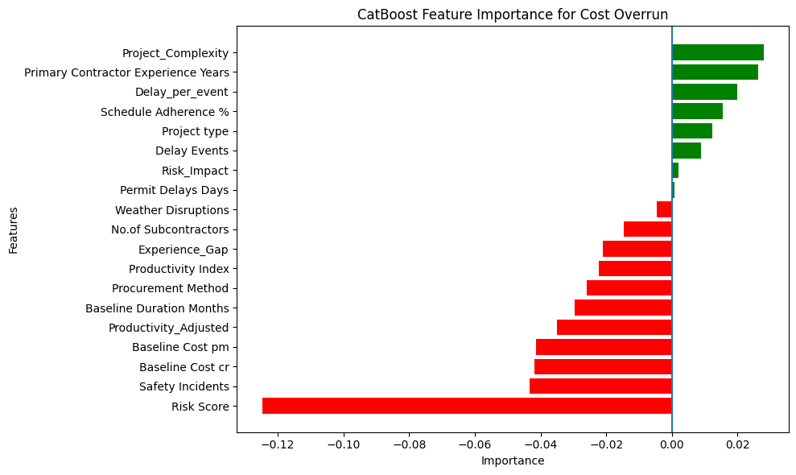

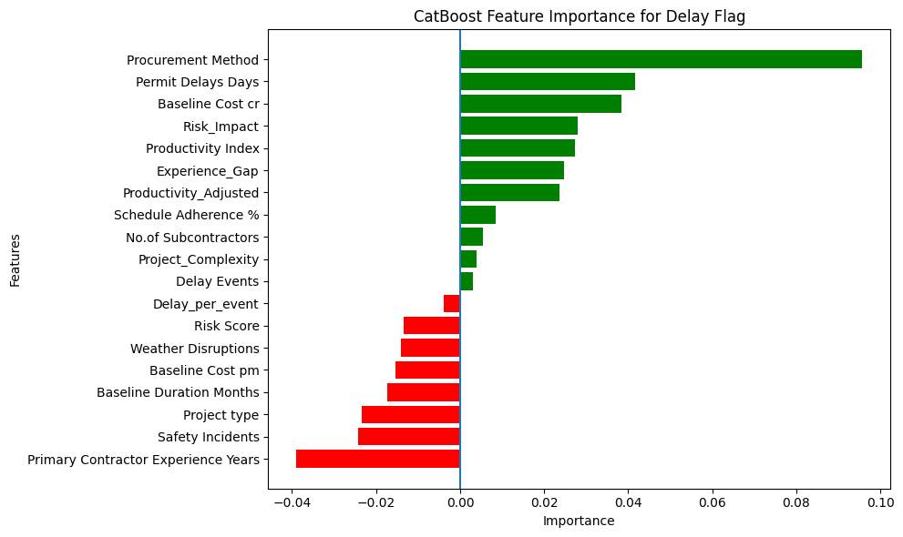

---

#### Validation of Feature Selection

To empirically evaluate the impact of feature selection before finalizing the feature set, two validation experiments were conducted using CatBoost and Stratified 10-Fold Cross-Validation.

##### Validation 1 – Positive Importance Features Only

For both target variables, only features with strictly positive **LossFunctionChange** importance scores were retained. CatBoost was subsequently re-trained and evaluated using the reduced feature set, and performance was compared against the full enriched feature set.

**Observation**

- For **Delay Prediction**, restricting the model to positive-importance features resulted in improved performance relative to the full feature set.
- For **Cost Overrun Prediction**, performance deteriorated when only positive-importance features were retained.
- This suggests that cost overrun prediction relies on a more diffuse and multifactor signal, where features with individually negative importance may still contribute to overall model effectiveness through interactions and collective structure.

---

##### Validation 2 – Mixed Feature Set for Cost Overrun

To further investigate the cost prediction problem, a second experiment was conducted in which all positive importance features and a subset of the least-negative importance features were retained.

**Observation**

- Model performance remained lower than that achieved using the complete enriched feature set.
- The results indicate that removing negatively ranked features reduces predictive capability, even when the least-negative features are preserved.
- This confirms that the full enriched feature set provides the strongest representation of the available cost overrun signal.

--- 


| Target | Feature Set | Accuracy Mean | F1 Mean | ROC-AUC Mean | MCC Mean |
|----------|----------|----------|----------|----------|----------|
| Cost Overrun | Before FS (All Features) | 0.520 | 0.473 | 0.505 | 0.042 |
| Cost Overrun | After FS (Positive Only) | 0.433 | 0.398 | 0.375 | -0.141 |
| Cost Overrun | After FS (Positive + Some Negative) | 0.433 | 0.398 | 0.375 | -0.141 |
| Delay | Before FS (All Features) | 0.547 | 0.649 | 0.534 | -0.032 |
| Delay | After FS (Positive Only) | 0.593 | 0.693 | 0.590 | 0.084 |

---

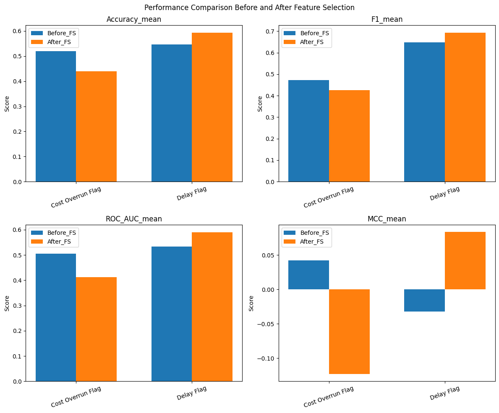

---

**Final Decision**

Based on the validation results, the final input feature sets were defined as: 

- For Cost Overrun – all 19 features (13 original + 6 engineered); 
- For Delay Flag – only features with positive LossFunctionChange importance (11 features).


---

### Final Modelling

Based on the baseline evaluation, Logistic Regression and CatBoost were selected for further optimization and detailed analysis.

#### Models used

1. Logistic Regression

Logistic Regression achieved the strongest overall performance for cost overrun prediction, recording the highest F1-score (0.532), ROC-AUC (0.593), and MCC (0.139) among all baseline models. Its consistent performance across multiple evaluation metrics indicated that the relationship between the available project features and cost overrun outcomes could be effectively captured using a linear model.

2. CatBoost

Although KNN achieved the highest F1score for delay prediction (0.734), CatBoost was selected as the representative nonlinear model due to its competitive performance, ability to capture complex feature interactions, robustness on tabular datasets, and compatibility with explainability techniques such as SHAP and Partial Dependence Plots. 

CatBoost also provided a strong contrast to Logistic Regression, enabling comparison between linear and ensemble-based learning approaches.

By selecting Logistic Regression and CatBoost, the study retained two fundamentally different modeling paradigms while focusing subsequent analysis on models that demonstrated strong predictive capability and practical interpretability.

3. Small Custom Neural Network

A two-hidden-layer Multilayer Perceptron [Input → 64 (ReLU) → Dropout(0.3) → 32 (ReLU) → Dropout(0.3) → 1 (Sigmoid)]. Intentionally shallow to prevent overfitting on the limited dataset. Binary Cross-Entropy loss with Adam optimizer. 

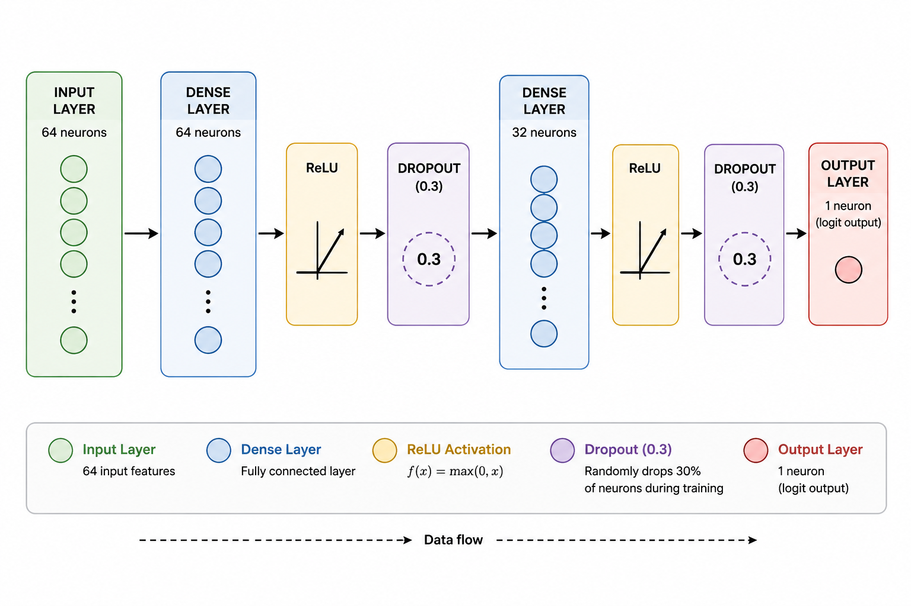

4. TabNet

An attention-based sequential architecture designed for tabular data. Uses sparse 
feature selection at each decision step via learned attention masks. Evaluated to test whether 
attention-based feature selection benefits this dataset. 

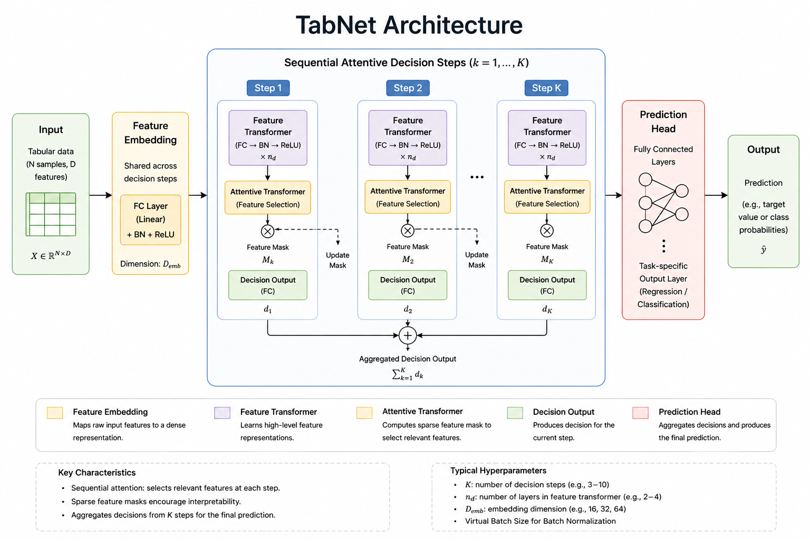

5. TabPFN

A pretrained transformer-based model that performs in context learning on small 
tabular datasets. Leverages prior knowledge distilled from synthetic datasets to generalize 
without dataset-specific training. Particularly well-suited for n < 1000 settings. 

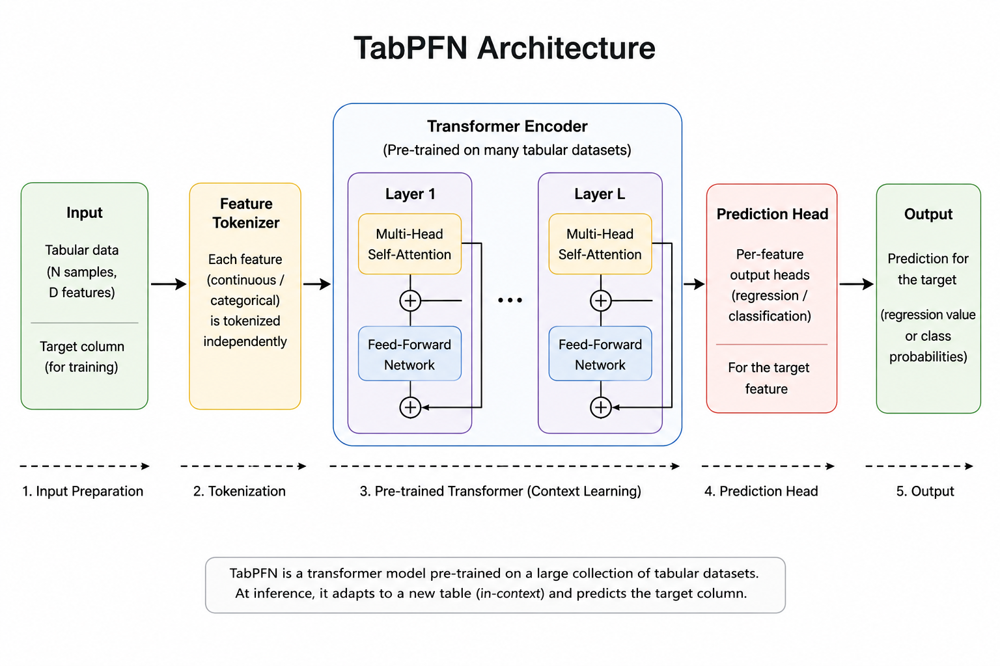


#### Hyperparameter Tuning

Following baseline evaluation, CatBoost and Logistic Regression were selected for detailed analysis. Hyperparameter optimization was performed only for CatBoost because its performance is highly dependent on parameters such as tree depth, learning rate, number of iterations, and regularization strength. Optimizing these parameters can significantly influence model behavior and predictive capability.


In contrast, Logistic Regression has a relatively small and well-understood hyperparameter space, and it already demonstrated strong baseline performance. Therefore, additional optimization was considered unlikely to yield substantial improvements. As a result, tuning efforts were focused on CatBoost, where the potential performance gains were expected to be more meaningful.


#### Final Modelling Results

- For **Cost Overrun Prediction**, Logistic Regression marginally outperforms CatBoost across all evaluation metrics (**F1: 0.55 vs. 0.51**, **ROC-AUC: 0.57 vs. 0.56**, **MCC: 0.11 vs. 0.10**).

- The superior performance of Logistic Regression suggests that the predictive signal for cost overrun is predominantly linear, aligning with the EDA findings of weak but largely linear relationships between the features and the target variable.

- CatBoost does not provide a meaningful advantage for cost prediction despite its ability to model complex non-linear interactions, indicating that additional model complexity alone is insufficient to improve performance.

- **TabPFN achieves the best overall performance for Cost Overrun Prediction**, substantially outperforming both Logistic Regression and CatBoost (**F1 ≈ 0.62**, **ROC-AUC ≈ 0.69**, **MCC ≈ 0.31**).

- The strong performance of TabPFN demonstrates the potential of pretrained in-context learning models to extract useful predictive patterns from small, weak-signal tabular datasets where traditional machine learning methods struggle.

- For **Delay Prediction**, CatBoost significantly outperforms Logistic Regression (**F1: 0.74 vs. 0.61**, **ROC-AUC: 0.58 vs. 0.46**, **MCC: 0.13 vs. ≈ 0.00**).

- The ROC-AUC score of Logistic Regression falls below the random-classifier threshold, indicating that the relationships governing project delay are inherently non-linear and are not adequately captured by a linear decision boundary.

- **CatBoost emerges as the best-performing model for Delay Prediction**, achieving the highest F1 Score (**≈ 0.74**) among all evaluated models.

- Although TabPFN demonstrates strong performance for cost prediction, it underperforms CatBoost for delay prediction (**F1 ≈ 0.60 vs. 0.74**), suggesting that specialized tree-based ensemble methods remain highly effective when clear structured patterns exist in the data.

- MLP achieves moderate performance for delay prediction (**F1 ≈ 0.65**) but does not surpass CatBoost.

- **TabNet consistently exhibits the weakest performance across both prediction tasks**, with particularly low recall values for Cost Overrun (**0.10**) and Delay (**0.37**).

- The poor performance of TabNet is likely attributable to the limited dataset size, which restricts its attention-based feature selection mechanism from learning robust and discriminative representations.

- The results indicate that TabNet's sequential attention architecture may require substantially larger datasets before its theoretical advantages can be effectively realized.

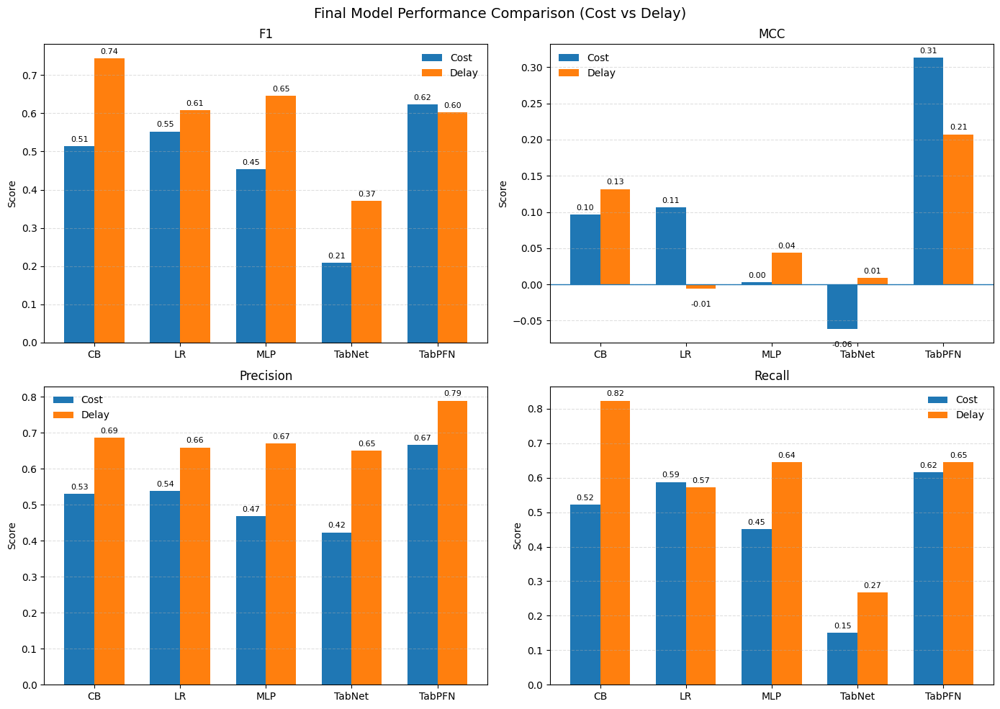

---


#### Model Ranking and Stability

Multiple evaluation metrics, including Accuracy, Precision, Recall, F1-score, ROC-AUC, and MCC, were used to assess model performance. However, F1-score was selected as the primary metric for model comparison and ranking.

F1-score represents the harmonic mean of Precision and Recall, providing a balanced measure of a model's ability to correctly identify positive cases while minimizing both false positives and false negatives. Since the objective of this study was to identify projects at risk of cost overruns or schedule delays, both types of classification errors were considered important.

Accuracy alone can be misleading because it does not distinguish between different types of errors. Precision focuses only on the correctness of positive predictions, while Recall focuses only on the ability to detect positive cases. F1-score combines both aspects into a single metric, making it more suitable for evaluating the practical effectiveness of the models.

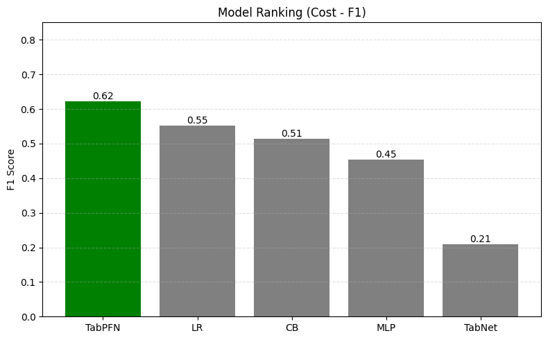

---

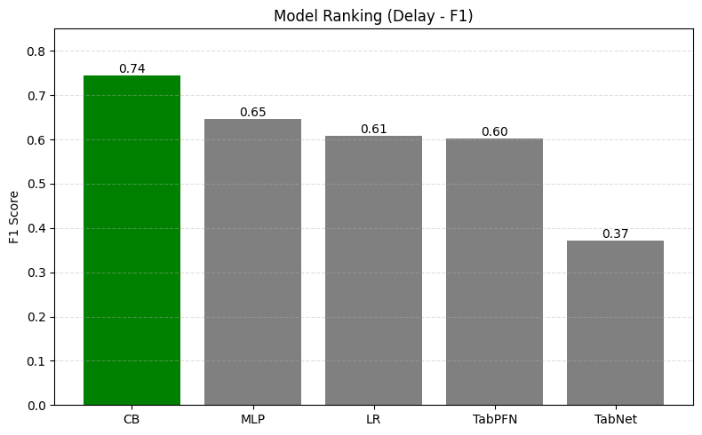


---

The model stability plot compares predictive performance (mean F1score) against variability across cross-validation folds (F1 std dev). Models located in the lower right region demonstrate the most desirable balance of high performance and low variance. 

The results show that TabPFN achieved the strongest performance for cost prediction, while CatBoost provided the best balance between performance and stability for delay prediction. In contrast, TabNet exhibited both lower performance and higher variability across folds.

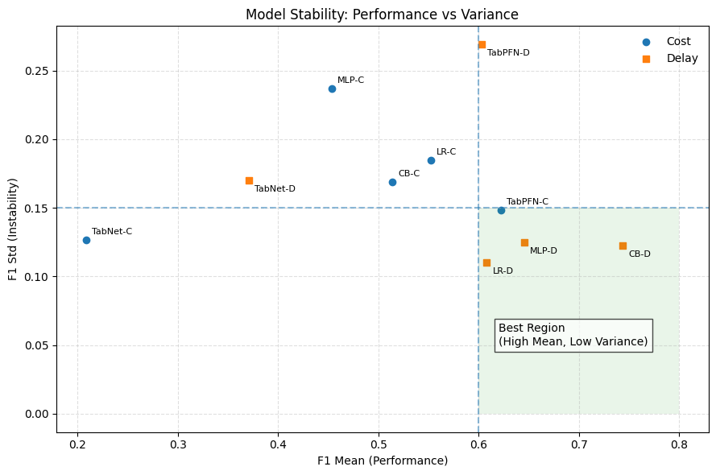