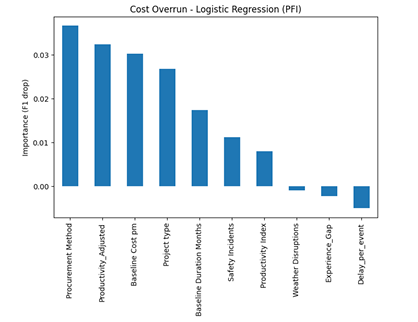
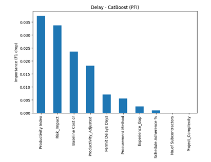
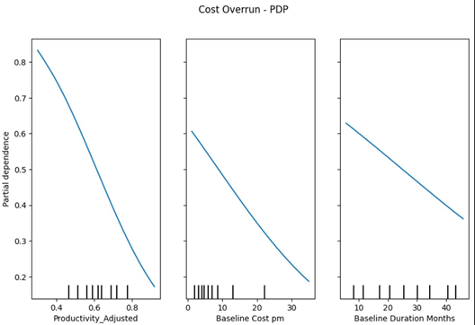
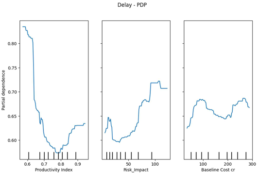
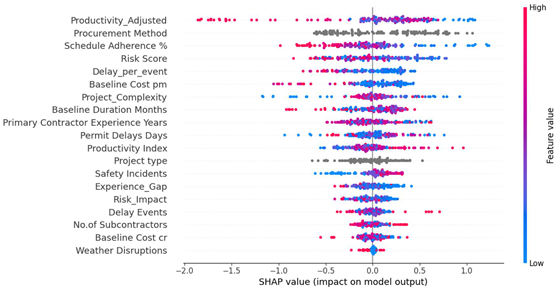
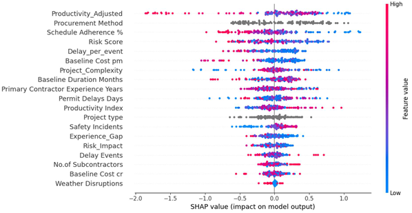

# Transition from Predictive Modelling to Explainable AI

The initial objective of this study was to develop reliable machine learning models capable of predicting cost overruns and schedule delays in construction projects. Multiple classical machine learning models, ensemble methods, deep learning architectures, and pretrained tabular models were evaluated using rigorous cross-validation and hyperparameter optimization procedures.

**The results indicated that delay prediction exhibited moderate predictive capability, whereas cost overrun prediction remained considerably more challenging**. Despite extensive experimentation involving feature engineering, feature selection, model tuning, and advanced neural architectures, the predictive performance for cost overruns remained limited and inconsistent across models. 

Furthermore, feature selection experiments demonstrated that removing seemingly less important features often degraded performance, suggesting that project outcomes were influenced by complex interactions distributed across multiple variables rather than a small subset of dominant predictors.

These findings raised an important question: rather than focusing solely on whether a project outcome can be predicted, can we understand the factors that contribute to that outcome?

To address this question, **the study shifted toward Explainable Artificial Intelligence (XAI). Explainability techniques such as Permutation Feature Importance (PFI), SHAP (SHapley Additive Explanations), and Partial Dependence Plots (PDPs) were employed to investigate how individual project characteristics influence model predictions**. This approach enabled the extraction of actionable insights even when predictive performance was limited.

By transitioning from pure prediction to explanation, the study provided stakeholders with a deeper understanding of the drivers behind cost overruns and project delays, supporting informed decision-making and risk management rather than relying solely on predictive accuracy.

In short:

*Although multiple machine learning and deep learning models were evaluated, cost overrun prediction remained challenging and feature selection experiments suggested that project outcomes were influenced by complex interactions among many variables. Consequently, the focus shifted from purely predicting outcomes to understanding the factors driving those outcomes. Explainable AI techniques such as SHAP, PDP, and PFI were therefore employed to extract actionable insights and support datadriven decision making.*

## Permutation Feature Importance

Permutation Feature Importance measure the change in the performance of the model after we permute the values of the feature (all the values of a features are randomly shuffled). Due to this the relationship between the feature and the target variable breaks.

The concept is straightforward: A feature is important is shuffling its values increase the model's loss, because in this case the model relied on the feature for the prediction. A feature is unimportant if shuffling its values leaves the model loss unchanged because in this case, the model ignored the feature for the prediction. 

**Step 1: Compute Original Model Performance**

Let the model's original performance be:

\[
F1_{orig} = 0.80
\]

---

**Step 2: Randomly Shuffle One Feature**

For example, shuffle the values of **Risk Score** across all projects.

This breaks the relationship between the feature and the target variable while keeping the feature distribution unchanged.

---

**Step 3: Compute Performance After Permutation**

After shuffling the feature, evaluate the model again:

\[
F1_{perm} = 0.60
\]

---

**Step 4: Calculate Feature Importance**

Feature Importance is calculated as:

\[
PFI = F1_{orig} - F1_{perm}
\]

Substituting the values:

\[
PFI = 0.80 - 0.60
\]

\[
PFI = 0.20
\]

---

**Interpretation**

- Large performance drop → Feature is highly important.
- Small performance drop → Feature has limited influence on predictions.
- No performance change → Feature contributes little to the model.

### PFI for Analysis

PFI was computed for the best-performing model for each target i.e., Logistic Regression for Cost Overrun and CatBoost for Delay.

- **Cost Overrun**

For Cost Overrun, Procurement Method, Productivity_Adjusted, Baseline Cost pm, and Project Type are the top features by PFI. 
However, importance values across the top features are relatively close (range: 0.008–0.036), indicating that no single feature dominates – cost overrun is influenced by many features with modest individual effects. Features such as Weather Disruptions, Experience_Gap, and Delay_per_event exhibit near-zero or negative importance, suggesting they add marginal or 
harmful information.

**Business Insights**

- **Procurement strategy is the most influential factor for cost overruns**, suggesting that careful selection and monitoring of procurement approaches can significantly impact project cost performance.

- **Productivity and cost planning variables strongly influence cost outcomes**, indicating that improving operational efficiency and developing realistic budget estimates can help reduce the likelihood of cost overruns.

---

- **Delay**

For delay prediction (CatBoost), PFI identifies Productivity Index and 
Risk_Impact as the top two features with a clear margin over the remaining features. A steep 
drop in importance after the top four features confirms that delay prediction is driven by a small 
set of dominant variables rather than many weak contributors. 

**Business Insights**

- **Productivity-related factors are the strongest drivers of project delays**, indicating that improving workforce efficiency, resource utilization, and operational productivity can significantly reduce the likelihood of schedule overruns.

- **Risk exposure and project scale also play a major role in delay occurrence**, suggesting that proactive risk management and enhanced monitoring of large budget projects should be prioritized during project planning and execution.

---

## Partial Dependence Plots 

The partial dependence plots shows the marginal effect one or two features have on the outcome of a machine learning model. A partial dependence plot can show whether the the relationship between the target and a feature is linear, monotonic or more complex. 

The main idea is:
>What is the average prediction of the model when we vary one feature while keeping all other features as they are in the dataset?

Consider a trained model:

\[
\hat{f}(X)
\]

where:

\[
X = (x_1, x_2, ..., x_p)
\]

represents all input features.

---

**Step 1: Select a Feature**

Suppose we want to study the effect of:

\[
x_s
\]

(e.g., Risk Score)

The remaining features are grouped as:

\[
x_c
\]

where:

\[
X = (x_s, x_c)
\]

---

**Step 2: Fix the Feature at a Specific Value**

Suppose we set:

\[
x_s = 0.5
\]

for every project in the dataset.

For each project:

\[
\hat{f}(0.5, x_c^{(i)})
\]

is computed.

---

**Step 3: Average Predictions Across All Projects**

The partial dependence value is:

\[
PD(x_s)
=
\frac{1}{n}
\sum_{i=1}^{n}
\hat{f}(x_s, x_c^{(i)})
\]

where:

- \(n\) = number of projects
- \(x_s\) = chosen feature value
- \(x_c^{(i)}\) = all remaining features for project \(i\)

---

**Example**

Suppose we want to analyze the effect of Risk Score.

Set:

\[
RiskScore = 0.5
\]

for every project.

The model predictions become:

| Project | Prediction |
|----------|------------|
| 1 | 0.62 |
| 2 | 0.58 |
| 3 | 0.70 |
| 4 | 0.65 |

Average prediction:

\[
PD(0.5)
=
\frac{0.62+0.58+0.70+0.65}{4}
\]

\[
PD(0.5)=0.6375
\]

This becomes one point on the PDP curve.

---

**Repeat for Many Values**

Now evaluate:

\[
RiskScore =
0.1,\;
0.2,\;
0.3,\;
...
\]

For each value:

1. Replace the feature value.
2. Predict using the model.
3. Compute the average prediction.

The resulting points form the PDP curve.

---

**Interpretation**

If the PDP curve rises:

\[
x_s \uparrow
\quad\Rightarrow\quad
Prediction \uparrow
\]

the feature has a positive influence.

If the PDP curve falls:

\[
x_s \uparrow
\quad\Rightarrow\quad
Prediction \downarrow
\]

the feature has a negative influence.

If the curve is flat:

\[
x_s
\]

has little effect on the model prediction.

- **Cost Overrun**

The PDP plots reveal clear decreasing monotonic relationships between 
Productivity_Adjusted, Baseline Cost pm, Baseline Duration Months and the predicted 
probability of cost overrun. Higher values of these features are associated with lower cost 
overrun probability. The near-linear shape of the PDPs corroborates the Logistic Regression 
finding – cost overrun follows straightforward, predominantly linear patterns rather than 
complex non-linear behavior. 

**Business Insights**

- **Higher productivity levels are associated with a lower probability of cost overruns**, highlighting the importance of improving workforce efficiency, resource utilization, and project execution practices.

- **Projects with larger baseline costs and longer planned durations exhibit a lower predicted risk of cost overrun**, suggesting that larger projects may benefit from more structured planning, stronger controls, and better resource allocation.

- The consistently decreasing PDP trends indicate that **productivity, realistic budgeting, and effective project planning are key factors in controlling project costs and minimizing budget deviations.**

- **Delay**

The delay PDP plots reveal a strong non-linear relationship between 
Productivity Index and delay probability – as productivity increases from 0.6 to 0.85, delay 
probability drops sharply from ~0.80 to ~0.60, indicating that productivity is a highly critical 
threshold variable. Risk_Impact shows an increasing trend, confirming that higher risk 
exposure raises delay likelihood. Baseline Cost shows a fluctuating, less consistent pattern. 

**Business Insights**

- **Productivity has a strong influence on project delays**, with the model indicating that lower productivity levels are associated with a higher likelihood of schedule overruns. This highlights the importance of improving workforce efficiency and operational performance.

- **Higher Risk Impact values substantially increase the predicted probability of delays**, suggesting that proactive identification and mitigation of project risks should be a key management priority.

- The relationship between Baseline Cost and delay risk is non-linear, indicating that project size alone does not determine delay outcomes. Instead, delays are likely influenced by a combination of project complexity, resource management, and risk-related factors.

---

## SHAP Analysis

This is inspired by the concept of Game Theory. A prediction can be explained by assuming that each feature value of the instance is a “player” in a game where the prediction is the payout. Shapley values,a method from coalitional game theory tell us how to fairly distribute the “payout” among the features.

- **Cost Overrun**

- Productivity_Adjusted is the most influential feature, indicating that productivity related factors play a critical role in determining cost overrun risk.

- Procurement Method is the second most important feature, suggesting that procurement decisions substantially influence project cost performance.

- Schedule Adherence %, Risk Score, Delay_per_event, and Baseline Cost are also major contributors to model predictions.

- Features such as Weather Disruptions and Baseline Cost cr have comparatively smaller impacts on cost overrun predictions.

**Directional Insights**

- Higher Productivity_Adjusted values (red points) are generally associated with negative SHAP values, indicating a reduction in predicted cost overrun risk.

- Higher Risk Score values tend to push predictions toward higher cost overrun probabilities, highlighting the importance of risk management.

- Better Schedule Adherence generally contributes to lower cost overrun risk, reflecting the close relationship between schedule performance and project cost control.

- Larger Delay_per_event values increase the model's predicted likelihood of cost overruns, indicating that severe delays can translate into higher project costs.

**Business Insights**

- Improving project productivity and maintaining schedule adherence may significantly reduce the likelihood of cost overruns.

- Procurement planning and risk management should be prioritized during project execution, as these factors exhibit strong influence on project cost outcomes.

- Projects experiencing severe delays per event should receive additional monitoring, as such disruptions are strongly associated with increased cost overrun risk.

---

- **Delay**

- Productivity_Adjusted is the most influential feature, indicating that productivityrelated factors play a dominant role in determining project delays.

- Procurement Method, Schedule Adherence %, and Risk Score are also among the strongest contributors, suggesting that project management practices and risk exposure significantly affect schedule performance.

- Delay_per_event and Baseline Cost pm exhibit substantial influence, indicating that both the severity of delays and project cost characteristics contribute to delay outcomes.

- Features such as Weather Disruptions and Baseline Cost cr have relatively limited impact on delay predictions compared to operational and productivity-related variables.

**Directional Insights**

- Higher Productivity_Adjusted values generally reduce the predicted probability of delays, while lower productivity levels increase delay risk.

- Higher Risk Score values tend to push predictions toward greater delay likelihood, highlighting the importance of proactive risk mitigation.

- Better Schedule Adherence contributes to lower delay probabilities, reflecting the close relationship between project execution efficiency and schedule performance.

- Larger Delay_per_event values increase the model's predicted likelihood of delays, suggesting that severe disruptions have a disproportionate effect on project timelines.

**Business Insights**

- Improving workforce productivity and maintaining schedule adherence may provide the greatest opportunity for reducing project delays.

- Projects with elevated risk levels should receive additional monitoring and mitigation efforts, as risk exposure is strongly associated with schedule overruns.

- Preventing a small number of severe delay events may be more effective than focusing solely on the total number of disruptions, as delay severity exhibits a strong influence on project outcomes.

## Summary of the XAI Methods

| Method | What It Does | Simple Interpretation |
|----------|----------|----------|
| **PFI (Permutation Feature Importance)** | Measures how much model performance decreases when a feature is randomly shuffled. | Identifies which features the model relies on most. If shuffling a feature causes a large drop in performance, that feature is important for prediction. |
| **PDP (Partial Dependence Plot)** | Shows how the model's prediction changes as the value of a feature increases or decreases while keeping other features fixed. | Helps understand the overall relationship between a feature and the predicted outcome. For example, it can show whether higher productivity reduces the likelihood of project delay. |
| **SHAP (SHapley Additive exPlanations)** | Calculates how much each feature contributes to an individual prediction. | Explains why the model made a specific prediction by showing which features pushed the prediction higher or lower and by how much. |